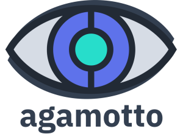

    

# agamotto - Wheel Options Strategy Management

    
    

**agamotto** is a Flask + React app for managing your Wheel options trading strategy. Like the MCU's [Eye of Agamotto](https://marvel.fandom.com/wiki/Eye_of_Agamotto), it allows you, the bold trader, to harness the power of ~~theta~~ time.

> **Note:** Code for the alpha version of **agamotto** will be released in due time.

## Motivation
There aren't many free or open-source trading journals for options out there. And there are even fewer that implement my specific variant of the Wheel strategy, in terms of the metrics and rules I use. With no tool that meets my full set of  unique needs, the only *option* was to develop one from scratch.

## Installation and Usage
See the [documentation](https://chrischow.github.io/agamotto/getting_started) for the detailed instructions.

## Features
**agamotto** enables you to:

- Scan for put options to initiate a Wheel strategy
- Log put/call options and stock trades
- Monitor your open options trades, with recommendations to buyback or roll
- Get a high-level overview of your profits, broken down by strategy, ticker, and trade

This is just a high-level description. See the [documentation](https://chrischow.github.io/agamotto/user_guide) for a full walkthrough of the app.

## Background on agamotto
This is the 3rd iteration of **agamotto**. The first was an options scanner built in Streamlit. I could identify trades with relatively good risk-to-reward ratio. However, these tickers did not produce a strong performance during paper trading because the underlying companies were relatively small and unstable, hence the high premiums and underestimated risk metrics. As I refined my strategy, I refined my toolkit.

The second iteration of **agamotto** was a 100% Flask app. There was no frontend library/framework - I simply dumped JavaScript into the templates that required them. As I was new to JavaScript at the time, my code was not particularly elegant, and the code base was poorly organised.

This time, I'm re-building the project after learning and getting some practice in React. 

The second was a Flask-only app that used JavaScript on specific templates. 

## Future Work
- Deployment:
    - [ ] Push container to Docker Hub
    - [ ] Set up GitHub Actions for CI
    - [ ] Develop **agamotto** cloud
- Admin:
    - [ ] Consider [Flask-Dance](https://flask-dance.readthedocs.io/en/latest/multi-user.html) for OAuth
- Dashboard:
    - TBC
- Monitor:
    - TBC
- Manage:
    - [ ] Upload CSV function - needs validation of dataframe
- Scan:
    - [ ] Enable creation of presets
- Analyse:
    - TBC
- Documentation:
    - Re-factor docs to installation + deployment for different platforms
        - [ ] Google App Engine (using containers)
        - [ ] Heroku
        - [ ] PythonAnywhere
- Publicity:
    - [ ] Launch on Reddit
    - [ ] Article on Medium.com

<b>Implemented</b>

- Admin:
    - [X] Login
    - [X] Amend password change facility
    - [X] Feature to download data, maybe on the Admin dashboard?
        - [X] CSV file
        - [X] ~~SQL file~~ (removed due to security)
    - [X] Use username instead of email
    - [X] Update admin page to long view with multiple sections
- Deployment:
    - [X] Docker build
- Dashboard:
    - [X] Strategy breakdown
    - [X] Overall table
    - [X] Plotly plot with wheel design
    - [X] Returns profile for strategy
- Monitor:
    - [X] Fix buyback feature: wrong computation for call; it should be to *close position*
- Manage:
    - [X] Create dedicated view for each trade as an intermediate page between the list of all trades and the edit page
    - [X] Create feature for deleting trades
- Scan:
    - TBC
- Analyse:
    - [X] Remove stock metadata scan - **agamotto** is for *option* selection, not for stock selection
- Documentation:
    - [X] Write documentation using [Just the Docs](https://github.com/pmarsceill/just-the-docs) ([demo site](https://pmarsceill.github.io/just-the-docs/))
    - [X] Re-locate images used for docs
    - [X] Remove Flask initialisation and password creation from Getting Started docs (i.e. do it prior to building)
    - [X] Write docs for admin dashboard
    - [X] Update screenshots for Strategy page
    - [X] Add docs for trade view: new view + delete function
    - [X] Remove stock metadata from Scan docs
    - [X] Remove stock lists from Analyse docs
    - Re-factor docs to installation + deployment for different platforms
        - [X] Local server (without Docker)
        - [X] Local server (with Docker)

## About the Project
**agamotto** is © 2022 by Christian Chow.

### License
It is distributed under the [MIT License](LICENSE).
